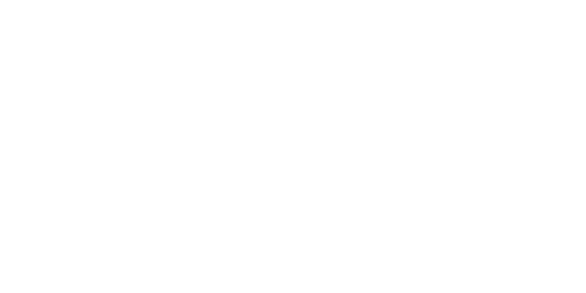

# <p align="center">Assur'Aimant Django Application</p>
<p align="center">
    
</p>

## ➤ Menu

* [➤ Project Structure](#-project-structure)
* [➤ How to Run](#-how-to-run)
* [➤ Requirements](#-requirements)
* [➤ Outputs](#-outputs)
* [➤ Evaluation Criteria](#-evaluation-criteria)
* [➤ Performance Metrics](#-performance-metrics)
* [➤ License](#-license)
* [➤ Authors](#-authors)

---

## Project Structure

This project is a Django application using Tailwind CSS for styling. It is developed as part of a training program. It includes the following main files and modules:

- **MyApp/**: Contains the main configuration of the Django application.
- **app/**: Contains views, models, and templates.
- **templates/**: Directory containing the HTML files of the application.
- **static/**: Contains static files, including images and styles.
- **requirements.txt**: List of dependencies required to run the project.

### Main Routes

- `/home/`: Application home page.
- `/register/`: User registration page.
- `/login/`: Login page.
- `/profil/`: User profile page.
- `/user_infos/`: Display user information.
- `/update_infos/`: Update user information.
- `/create_insurance_infos/`: Create insurance information.
- `/prediction/`: Insurance premium prediction page.
- `/logout/`: User logout.

---

## How to Run

Follow these steps to run the project:

1. Ensure that Python and the required dependencies are installed.
2. Clone this repository to your local machine:

```bash
    git clone https://github.com/username/assuraimant.git
```
3. Navigate to the project directory:

```bash
    cd MyApp
```
4. Install the required dependencies:

```bash
    pip install -r requirements.txt
```
5. Apply migrations and start the Django server:

```bash
    python manage.py migrate
    python manage.py runserver
```
6. Start Tailwind (if necessary):

```bash
    python manage.py tailwind start
```

The application will be accessible at: `http://127.0.0.1:8000/`

---

## Outputs

The application allows users to:

- Register and log in.
- Manage their profile and update their information.
- Get an estimate of their health insurance premium.
- View a smooth and responsive user interface.

### Example Output

<p align="center"><i>A demonstration video of the application is available in the folder: <code>MyApp/static/images/home_demo.mp4</code></i></p>

---

## Evaluation Criteria

### Mandatory Features

- **SQLite Database**: Securely stores user information.
- **Home Page**: Clear presentation with access to registration and login.
- **Authentication System**: Account creation, login/logout.
- **Profile Page**: Modify insurance-related information.
- **Prediction Page**: Pre-filled form and display of the estimated amount.
- **User Interface**: Tailwind CSS, intuitive navigation.
- **Production**: DEBUG mode disabled.

---

## Performance Metrics

### Mandatory
- Fully functional application meeting the specified requirements.
- Clean, structured, and well-documented code.
- Clear and professional presentation.

### Bonus
- Prediction history.
- Well-designed and responsive interface.
- Interactive appointment booking page.
- Detailed technical documentation.

---

## License

[MIT License](LICENSE)

---

## Authors
<div>
<h4>Sami Kabdani </h4>
<a href = "mailto: samikabdani.pro@gmail.com"></a>
<!-- <a href="  " target="_blank">
   -->
</a>  
<a href="https://github.com/Sami-Kbdn" target="_blank">
  
</a>
</div><div>
<h4>Nicolas Cassonet </h4>
<a href = "mailto: nicolas.cassonnet@wanadoo.fr"></a>
<a href="https://www.linkedin.com/in/nicolas-cassonnet-98871716/" target="_blank">
  
</a>  
<a href="https://github.com/NicoCasso" target="_blank">
  
</a>
</div>
<div>
<h4>Khadija AASSI </h4>
<a href = "mailto: aassikhadija@gmail.com"></a>
<a href="https://www.linkedin.com/in/khadija-aassi" target="_blank">
  
</a>  
<a href="https://github.com/khadaassi" target="_blank">
  
</a>
</div>
